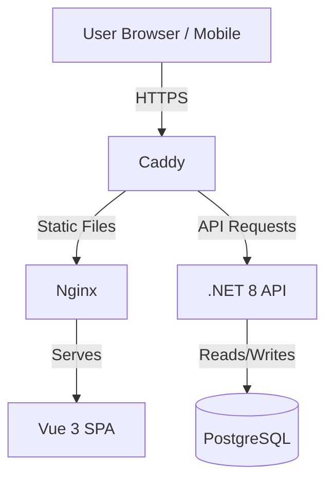
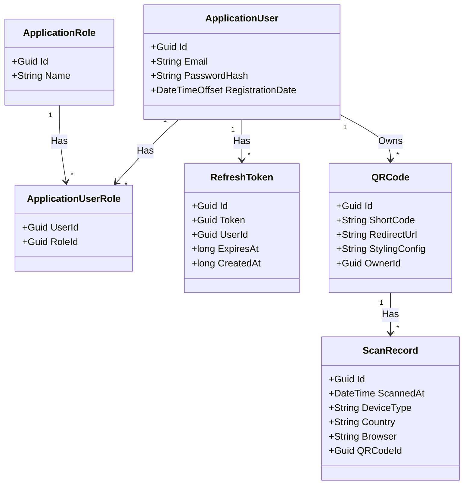

---
# QR Manager
**Website:** [https://qr.smogrovic.com/](https://qr.smogrovic.com/)

**Author:** Marek Šmogrovič

**Course:** I-ASOS

**Project:** QR Manager

---

## 1\. Documentation & Requirements

### Problem Statement

Standard QR codes are static. Once printed, the destination URL cannot be changed. Additionally, businesses and individuals lack insight into who is scanning their codes, when, and from where. **QR Manager** solves this by providing **Dynamic QR Codes**, permanent QR codes that redirect to modifiable destination URLs. It also serves as a centralized platform to track scan performance and gather analytics.

### Functional Requirements

- **User Authentication:** Users can register, login (via Email or Google), and manage their profiles. Secure session management using JWT and Refresh Tokens.
- **QR Code Management:**
  - **Create:** Generate new dynamic QR codes with custom short-links.
  - **Customize:** Users can customize the QR style (colors, dot shapes, corner styles).
  - **Update:** Change the destination URL of a printed QR code instantly.
  - **Delete:** Remove QR codes.
- **Scanning & Redirection:** The system handles incoming HTTP requests via short-codes, logs the scan data (User Agent, IP, Device Type), and redirects the user to the target URL.
- **Analytics Dashboard:** Users can view charts and statistics regarding their QR codes:
  - Total scans over time.
  - Device type distribution (Mobile, Desktop, Tablet).
  - Geographic data (Country).
  - Operating System and Browser stats.

### Non-Functional Requirements

- **Performance:** Redirection must occur in under 200ms to ensure a smooth user experience.
- **Scalability:** The architecture supports separation of concerns (CQRS) allowing the read (analytics) and write (scans) sides to scale independently.
- **Security:** Passwords hashed via Identity. API endpoints protected via JWT Bearer tokens.
- **Usability:** Responsive Web Design (RWD) ensuring the dashboard works on mobile and desktop devices.

---

## 2\. Planning

### Team Roles

- **Marek Šmogrovič:** Full Stack Developer, DevOps, QA, and Product Manager (Solo Project).

### Project Timeline


---

## 3\. Architecture & Design

### High-Level Architecture

The system follows a **Client-Server** architecture.



### UML Class Diagram



### Use Case Diagram


### Sequence Diagram


### Activity Diagram


### Architecture Justification

- **Monolithic Architecture:**
  - **Simplicity for Solo Development:** As a single developer working on the project, a monolith significantly reduces operational complexity compared to microservices. There is no need to manage inter-service communication.
  - **Ease of Deployment:** The entire project is packaged as a single Docker compose, simplifying the CI/CD pipeline and reducing hosting costs.
- **Vertical Slice Architecture (Backend):** Instead of distinct layers (Controller -\> Service -\> Repo), the app is organized by **Features** (e.g., `Features/Auth`, `Features/QRCodes`). This keeps related logic (Commands, Queries, Validators) together, reducing coupling and making maintenance easier.
- **CQRS (Command Query Responsibility Segregation):** Implemented via **MediatR**. This separates read operations (Analytics) from write operations (Creating QRs/Scanning), allowing for optimized query handlers.


<em>Source: <a href="[https://www.jimmybogard.com/vertical-slice-architecture/](https://www.jimmybogard.com/vertical-slice-architecture/)">[https://www.jimmybogard.com/vertical-slice-architecture/](https://www.jimmybogard.com/vertical-slice-architecture/)</a></em>

---

## 4\. Tech Stack Analysis

### Frontend

- **Framework:** **Vue.js 3** (Composition API). Chosen for its lightweight nature and reactivity.
- **UI Library:** **Quasar Framework**. chosen for its comprehensive component library (Material Design) and out-of-the-box responsive grid, significantly speeding up solo development.
- **State Management:** **Pinia**. The modern standard for Vue state management.
- **API Client:** **openapi-fetch** & **openapi-typescript**. Selected for lightweight, zero-runtime-overhead type safety. It automatically synchronizes TypeScript interfaces with the Backend's Swagger definition, eliminating manual type declaration.
- **Charts:** **ApexCharts**.

### Backend

- **Language:** **C\# / .NET 8**. Chosen for strong typing, high performance, and robust tooling.
- **API Framework:** **ASP.NET Core Web API** (using **Carter** for Minimal APIs).
- **Libraries:**
  - **MediatR:** For implementing the Mediator pattern and CQRS.
  - **FluentValidation:** For robust request validation.
  - **DeviceDetector.NET:** For parsing User-Agent strings during scans.

### Database

- **Primary DB:** **PostgreSQL**. An open-source, robust relational database.
- **ORM:** **Entity Framework Core**. Simplifies database interactions and migrations.
- **Decision (Relational vs. NoSQL):** SQL selected over NoSQL to ensure Data Integrity (enforcing strict User → QR → Scan relationships via Foreign Keys) and for its Analytics capabilities (native support for aggregations like `GROUP BY` required for the dashboard).

### Deployment

- **Containerization:** **Docker**. The entire stack (Frontend, Backend, DB) is dockerized for consistent environments.
- **Hosting Strategy:** Designed to run via `docker-compose`. Can be deployed to any VPS.
- **Production Site:** The application is deployed at **[https://qr.smogrovic.com/](https://qr.smogrovic.com/)**. It is hosted on a **Hetzner VPS** running **Ubuntu 24.04** (LTS), utilizing Docker.

---

## 5\. Implementation

### Backend Implementation

- **REST API:** The application exposes a RESTful API. Endpoints are defined using **Carter** modules (e.g., `app.MapPost("/login")`).
- **Authentication:** Implements standard **Identity** with **JWT Access Tokens** and **Refresh Tokens**. Includes Google OAuth integration.
- **Database:** Configured via `AppDbContext`. Migrations are applied via CLI.

### Frontend Implementation

- **Functional UI:**
  1.  **Dashboard:** Displays aggregate statistics using ApexCharts.
  2.  **QR Builder:** A reactive form where users input a URL and see a live preview of the QR code styles.
  3.  **QR List:** A data table with pagination and sorting to manage existing codes.

- **Type-Safe API Integration:**
  * **Schema Generation:** The project leverages **OpenAPI (Swagger)** to maintain a strict contract between Client and Server. The `npm run generate-openapi-schema` script uses **openapi-typescript** to scan the running Backend's `swagger.json` and generate precise TypeScript definitions (`src/api/generated/schema.d.ts`).
  * **Client Usage:** **openapi-fetch** serves as the HTTP client. Unlike traditional clients (like Axios), it uses the generated schema to provide IntelliSense and compile-time error checking for API paths, parameters, and response bodies.
  * **Auth Wrapper:** A custom wrapper (`src/api/client.ts`) intercepts requests to inject **JWT Bearer** tokens and handles **401 Unauthorized** responses by automatically triggering the Refresh Token flow and retrying the request seamlessly.


- **UX Flow:** The application uses `vue-router` with route guards (`requiresAuth`) to protect private pages. Toast notifications (`vue3-toastify`) provide feedback for actions.


### Repository Structure
The project is organized as a monorepo containing the Backend API, Frontend SPA, and Docker infrastructure configuration.

#### 1. Root & Infrastructure (`/` & `/docker`)
The root directory contains project documentation, while the `docker` folder handles orchestration. The `caddy` subdirectory explicitly configures the reverse proxy layer, defining how incoming HTTP requests are routed to the frontend and backend services.

```text
/
├── docker/
│   ├── caddy/              # Caddy Reverse Proxy setup
│   │   ├── Caddyfile.template # Configuration template (routing & headers)
│   │   └── compose.caddy.yaml # Separate Compose service definition for Caddy
│   ├── .env.template       # Environment variable template
│   └── compose.yaml        # Main Docker Compose orchestration
└── README.md               # Project documentation
```

#### 2. Backend (`/backend`)
The backend follows **Vertical Slice Architecture**. Instead of technical layers, the code is organized by **Features**.

```text
backend/
├── src/Api/
│   ├── Common/             # Shared logic (Errors, Pagination, Utils)
│   ├── Data/               # DB Context & EF Core Migrations
│   ├── Features/           # Vertical Slices (CQRS Implementation)
│   │   ├── Auth/           # Login, Register, Refresh Token logic
│   │   ├── QRCodes/        # CRUD operations for QR Codes
│   │   └── QRScanRecords/  # Scanning logic & Analytics queries
│   ├── Extensions/         # Extension methods (IQueryable, Claims)
│   ├── Program.cs          # App entry point & Middleware config
│   └── appsettings.json    # Configuration
└── tests/
    ├── Api.IntegrationTests/ # Full flow tests using Testcontainers
    └── Api.UnitTests/        # Isolated unit tests (xUnit)
```

#### 3. Frontend (`/frontend`)
The frontend is built with **Vue 3** and **Quasar**, following a standard modular structure.

```text
frontend/
├── public/                 # Static assets (Icons, Favicons)
├── src/
│   ├── api/                # Generated Typescript services for API
│   ├── assets/             # Images & dynamic shapes for QR generation
│   ├── boot/               # Initialization scripts (i18n, Google Login)
│   ├── components/         # Reusable UI components
│   │   ├── analytics/      # Charts & Stats views
│   │   ├── core/           # Shared UI (Dialogs, Search, Sidebar)
│   │   └── qr-codes/       # QR Builder & Preview components
│   ├── layouts/            # MainLayout (Sidebar) & PageLayout
│   ├── pages/              # Route views (Dashboard, Login, Edit QR)
│   ├── stores/             # Pinia state stores (Auth, etc.)
│   ├── utils/              # Helper functions (Date formatting, Validators)
│   └── router/             # Vue Router configuration
└── tests/
    ├── integration/        # E2E tests using Playwright
    └── unit/               # Unit tests using Vitest
```


## 6\. Testing

### Unit Tests

- **Backend:** Located in `tests/Api.UnitTests`. Uses **xUnit** to test handlers (e.g., `GetScanAnalyticsHandlerTests`, `QRCodeExtensionsTests`).
- **Frontend:** Located in `frontend/tests/unit`. Uses **Vitest** for testing utility functions (e.g., `date-utils`, `qr-url`) and component logic.

### Integration Tests

- **Backend:** Located in `tests/Api.IntegrationTests`. Uses `WebApplicationFactory` to spin up an in-memory test server. Tests cover full API flows (Register -\> Login -\> Create QR).
- **Database:** Integration tests utilize **Testcontainers** to spin up an isolated, **PostgreSQL** Docker container for the testing. This ensures tests run against a real database instance rather than an in-memory mock, guaranteeing that EF Core configurations and queries are valid. To maintain test isolation and determinism, the **Respawn** library is used to reset the database state (checkpointing and cleaning tables) before every single test execution, ensuring a clean slate for each scenario.

### System / End-to-End (E2E) Tests

- **Tool:** **Playwright** (configured in `frontend/playwright.config.ts`).
- **Scope:** Validates critical user journeys:
  1.  User loads the landing page.
  2.  User logs in successfully.
  3.  User creates a QR code and verifies it appears in the list.

### Test Execution Results


---

## 7. How to Run

### Production Environment

1. **Navigate to the Docker folder:**

```bash
cd ./docker
```

2. **Configure Environment Variables:**
   Copy the template file to create your production environment configuration.

```bash
cp .env.template .env
```

3. **Start the Services:**
   Run the application stack in detached mode.

```bash
docker compose up -d
```

4. **Apply Database Migrations:**
   Execute the self-contained migration bundle inside the running backend container.

```bash
docker exec -it qr-manager-backend-1 sh -c "./appMigration"
```

### Local Development Environment

#### 1. Database Setup

Ensure you have a PostgreSQL instance running. You can use the provided Docker Compose service for this.

```bash
cd ./docker
docker compose up -d pg
```

#### 2. Frontend Setup

1. Navigate to the frontend directory:

```bash
cd ./frontend
```

2. Install the dependencies:

```bash
npm install --legacy-peer-deps
```

3. Start the development server:

```bash
npm run dev
```

#### 3. Backend Setup

1. **Prerequisites:** Ensure **.NET SDK 8.0** is installed.
2. Install the **Entity Framework Core Global Tool** (if not already installed):

```bash
dotnet tool install --global dotnet-ef
```

3. Navigate to the backend API project folder:

```bash
cd ./backend/src/Api
```

4. Update the database schema:

```bash
dotnet ef database update --context AppDbContext
```

5. Run the API in watch mode:

```bash
dotnet watch
```
