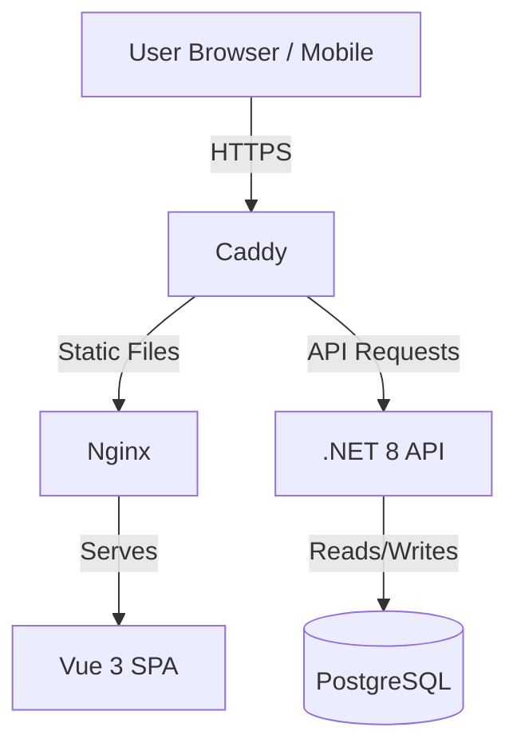
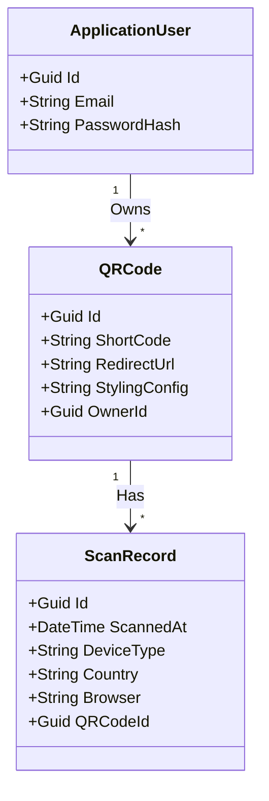
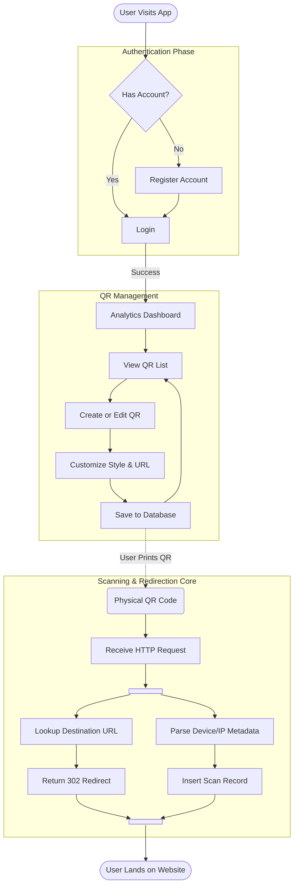

-----

# QR Manager

**Author:** Marek Šmogrovič  
**Course:** ASOS  
**Project:** QRManager

-----

## 1\. Documentation & Requirements

### Problem Statement

Standard QR codes are static. Once printed, the destination URL cannot be changed. Additionally, businesses and individuals lack insight into who is scanning their codes, when, and from where. **QR Manager** solves this by providing **Dynamic QR Codes**, permanent QR codes that redirect to modifiable destination URLs. It also serves as a centralized platform to track scan performance and gather analytics.

### Functional Requirements

  * **User Authentication:** Users can register, login (via Email or Google), and manage their profiles. Secure session management using JWT and Refresh Tokens.
  * **QR Code Management:**
      * **Create:** Generate new dynamic QR codes with custom short-links.
      * **Customize:** Users can customize the QR style (colors, dot shapes, corner styles).
      * **Update:** Change the destination URL of a printed QR code instantly.
      * **Delete:** Remove QR codes.
  * **Scanning & Redirection:** The system handles incoming HTTP requests via short-codes, logs the scan data (User Agent, IP, Device Type), and redirects the user to the target URL.
  * **Analytics Dashboard:** Users can view charts and statistics regarding their QR codes:
      * Total scans over time.
      * Device type distribution (Mobile, Desktop, Tablet).
      * Geographic data (Country).
      * Operating System and Browser stats.

### Non-Functional Requirements

  * **Performance:** Redirection must occur in under 200ms to ensure a smooth user experience.
  * **Scalability:** The architecture supports separation of concerns (CQRS) allowing the read (analytics) and write (scans) sides to scale independently.
  * **Security:** Passwords hashed via Identity. API endpoints protected via JWT Bearer tokens.
  * **Usability:** Responsive Web Design (RWD) ensuring the dashboard works on mobile and desktop devices.

-----

## 2\. Planning

### Team Roles

  * **Marek Šmogrovič:** Full Stack Developer, DevOps, QA, and Product Manager (Solo Project).

### Project Timeline

-----

## 3\. Architecture & Design

### High-Level Architecture

The system follows a **Client-Server** architecture tailored with **Vertical Slice Architecture** on the backend.

### UML Class Diagram

### Use Case Diagram

### Sequence Diagram

### Activity Diagram

### Architecture Justification
 * **Monolithic Architecture:**
      * **Simplicity for Solo Development:** As a single developer working on the project, a monolith significantly reduces operational complexity compared to microservices. There is no need to manage inter-service communication.
      * **Ease of Deployment:** The entire project is packaged as a single Docker compose, simplifying the CI/CD pipeline and reducing hosting costs.
  * **Vertical Slice Architecture (Backend):** Instead of distinct layers (Controller -\> Service -\> Repo), the app is organized by **Features** (e.g., `Features/Auth`, `Features/QRCodes`). This keeps related logic (Commands, Queries, Validators) together, reducing coupling and making maintenance easier.
  * **CQRS (Command Query Responsibility Segregation):** Implemented via **MediatR**. This separates read operations (Analytics) from write operations (Creating QRs/Scanning), allowing for optimized query handlers.

-----

## 4\. Tech Stack Analysis

### Frontend

  * **Framework:** **Vue.js 3** (Composition API). Chosen for its lightweight nature and reactivity.
  * **UI Library:** **Quasar Framework**. chosen for its comprehensive component library (Material Design) and out-of-the-box responsive grid, significantly speeding up solo development.
  * **State Management:** **Pinia**. The modern standard for Vue state management.
  * **Charts:** **ApexCharts**.

### Backend

  * **Language:** **C\# / .NET 8**. Chosen for strong typing, high performance, and robust tooling.
  * **API Framework:** **ASP.NET Core Web API** (using **Carter** for Minimal APIs).
  * **Libraries:**
      * **MediatR:** For implementing the Mediator pattern and CQRS.
      * **FluentValidation:** For robust request validation.
      * **DeviceDetector.NET:** For parsing User-Agent strings during scans.

### Database

  * **Primary DB:** **PostgreSQL**. An open-source, robust relational database chosen for its reliability and support for complex queries needed for analytics.
  * **ORM:** **Entity Framework Core**. Simplifies database interactions and migrations.

### Deployment

  * **Containerization:** **Docker**. The entire stack (Frontend, Backend, DB) is dockerized for consistent environments.
  * **Hosting Strategy:** Designed to run via `docker-compose`. Can be deployed to any VPS.

-----

## 5\. Implementation

### Backend Implementation

  * **REST API:** The application exposes a RESTful API. Endpoints are defined using **Carter** modules (e.g., `app.MapPost("/login")`).
  * **Authentication:** Implements standard **Identity** with **JWT Access Tokens** and **Refresh Tokens**. Includes Google OAuth integration.
  * **Database:** Configured via `AppDbContext`. Migrations are applied via CLI.

### Frontend Implementation

  * **Functional UI:**
    1.  **Dashboard:** Displays aggregate statistics using ApexCharts.
    2.  **QR Builder:** A reactive form where users input a URL and see a live preview of the QR code styles.
    3.  **QR List:** A data table with pagination and sorting to manage existing codes.
  * **UX Flow:** The application uses `vue-router` with route guards (`requiresAuth`) to protect private pages. Toast notifications (`vue3-toastify`) provide feedback for actions.
-----

## 6\. Testing

### Unit Tests

  * **Backend:** Located in `tests/Api.UnitTests`. Uses **xUnit** to test handlers (e.g., `GetScanAnalyticsHandlerTests`, `QRCodeExtensionsTests`).
  * **Frontend:** Located in `frontend/tests/unit`. Uses **Vitest** for testing utility functions (e.g., `date-utils`, `qr-url`) and component logic.

### Integration Tests

  * **Backend:** Located in `tests/Api.IntegrationTests`. Uses `WebApplicationFactory` to spin up an in-memory test server. Tests cover full API flows (Register -\> Login -\> Create QR).
* **Database:** Integration tests utilize **Testcontainers** to spin up an isolated,  **PostgreSQL** Docker container for the testing. This ensures tests run against a real database instance rather than an in-memory mock, guaranteeing that EF Core configurations and queries are valid. To maintain test isolation and determinism, the **Respawn** library is used to reset the database state (checkpointing and cleaning tables) before every single test execution, ensuring a clean slate for each scenario.

### System / End-to-End (E2E) Tests

  * **Tool:** **Playwright** (configured in `frontend/playwright.config.ts`).
  * **Scope:** Validates critical user journeys:
    1.  User loads the landing page.
    2.  User logs in successfully.
    3.  User creates a QR code and verifies it appears in the list.
